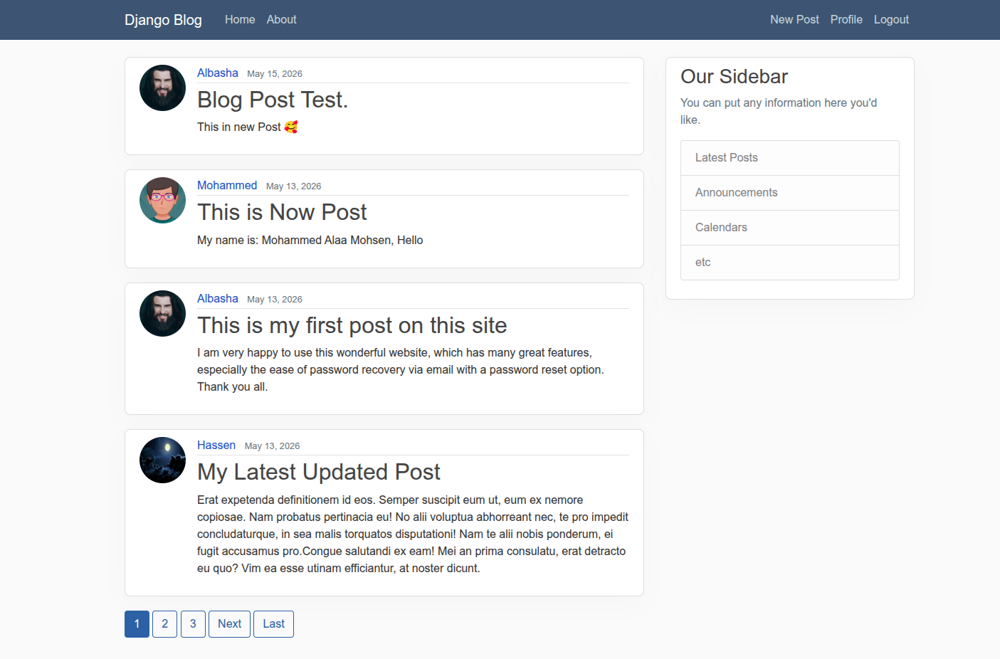
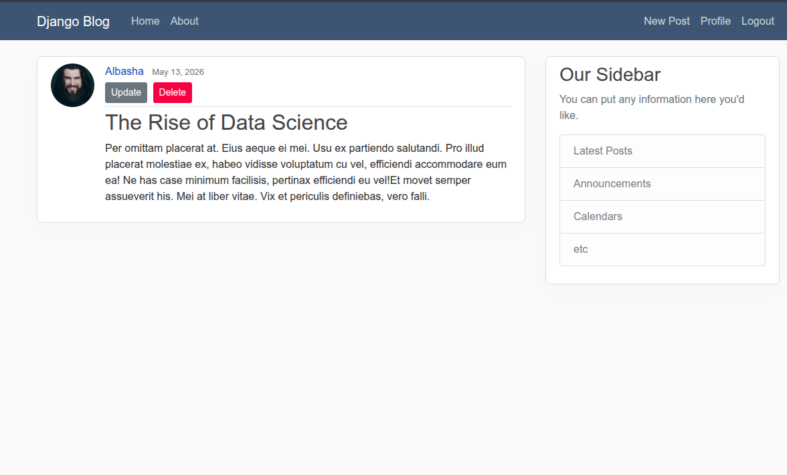
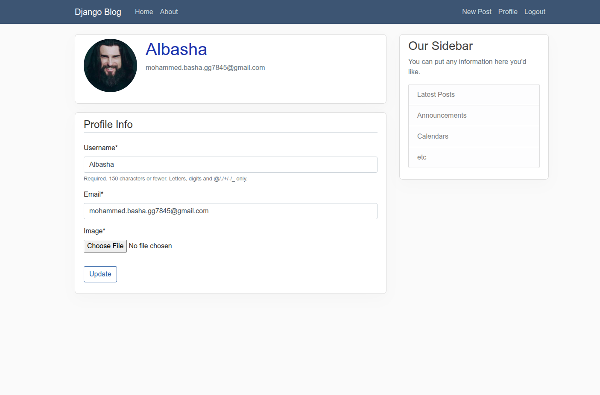
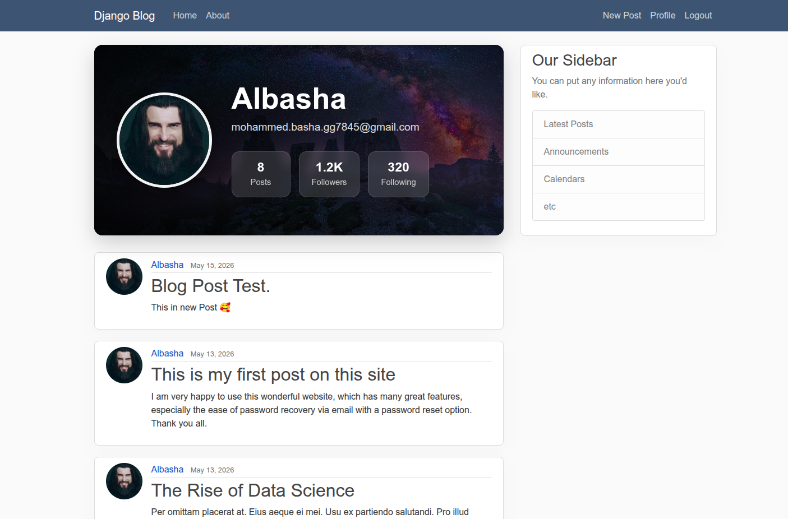
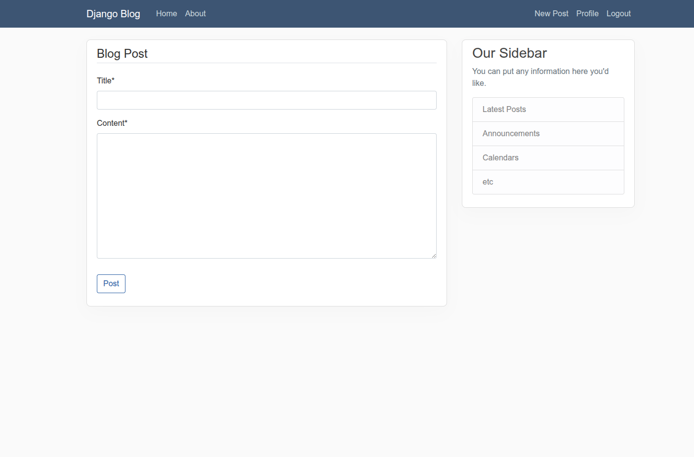
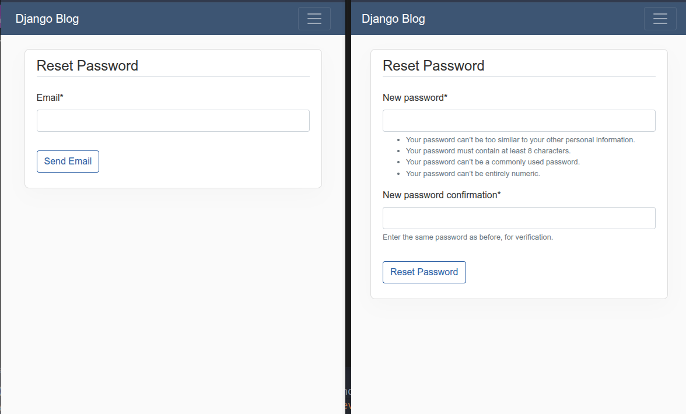

# Django-Blog

A modern Django blog web application featuring user authentication, profile management, post CRUD operations, image uploads, and password reset functionality.

---

# Application Preview

## Home Page



---

## Post Page



---

## User Profile-Setting



---

## User Profile-Post



---

## Create / Update Post



---

## Password Reset



---

## And Page Login & Sign Up

...

---

The project was built while learning Django fundamentals and focuses on understanding:
- Django ORM
- Authentication System
- Class-Based Views
- Forms & ModelForms
- User Profiles
- Media Handling
- Signals
- Pagination
- Password Reset System

---

# Features

- User Registration & Login
- Authentication System
- Password Reset via Email
- User Profile Management
- Profile Picture Upload
- Automatic Image Resizing
- Create / Update / Delete Posts
- User-Specific Posts Page
- Pagination
- Django ORM Relationships
- Class-Based Views (CBV)
- Function-Based Views (FBV)
- Crispy Forms Integration
- Media File Handling
- Secure Environment Variables using `.env`

---

# Technologies Used

- Python 3
- Django
- SQLite
- Pillow
- Crispy Forms
- Bootstrap 4

---

# Installation

## 1. Clone the repository

```bash
git clone https://github.com/YOUR_USERNAME/Django-Blog.git
cd Django-Blog
```

---

## 2. Create virtual environment

### Linux / macOS

```bash
python -m venv .venv
source .venv/bin/activate
```

### Windows

```bash
python -m venv .venv
.venv\Scripts\activate
```

---

## 3. Install project dependencies

```bash
pip install -r requirements.txt
```

---

# Environment Variables Setup

This project uses environment variables to keep sensitive data secure.

## 4. Create your `.env` file

Create a file named:

```text
.env
```

Then add:

```env
EMAIL_USER=your_email_here
EMAIL_PASS=your_password_here
SECRET_KEY=your_secret_key_Project_here
```

---

# Database Setup

This project uses SQLite as the default database.

Apply migrations using:

```bash
python manage.py migrate
```

---

# Create Superuser

To access the Django admin panel:

```bash
python manage.py createsuperuser
```

---

# Run the Development Server

```bash
python manage.py runserver
```

Then open:

```text
http://127.0.0.1:8000/
```

---

# Project Structure

```text
Django-Blog/
│
├── blog/               # Blog application
├── users/              # Users & authentication
├── media/              # Uploaded profile images
├── django_project/     # Main project settings
├── static/             # Static files
├── templates/          # HTML templates
├── .env
├── requirements.txt
└── manage.py
```

---

# Authentication Features

- User Registration
- User Login & Logout
- Email-Based Password Reset
- Protected Profile Page
- Authentication Redirects
- Login Required Permissions

---

# User Profile Features

- Profile Image Upload
- Automatic Image Resizing
- One-to-One Relationship with Django User Model
- Editable Username & Email

---

# Blog Features

- Home Page Posts Feed
- Post Detail Page
- Create New Posts
- Update Existing Posts
- Delete Posts
- User Posts Filtering
- Pagination System

---

# Learning Objectives

This project was created to deeply understand:

- Django Models
- Django ORM
- Authentication System
- Signals
- Forms & ModelForms
- Generic Class-Based Views
- Media Handling
- URL Routing
- Context & Templates
- QuerySets & Relationships

---

# Future Improvements

- Follow System
- Comments System
- Likes & Reactions
- Notifications
- REST API Integration
- Deployment

---

# License

This project is open-source and available for learning purposes.
